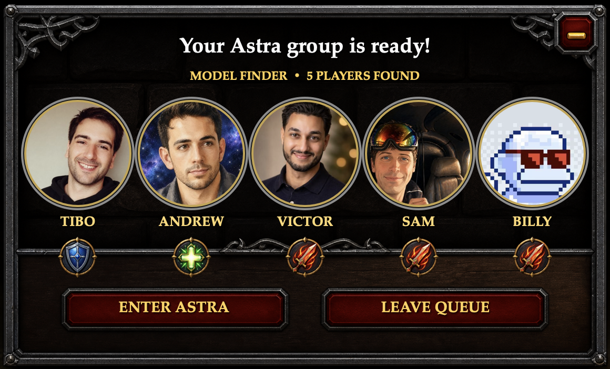

# Model Finder

A World of Warcraft-style ready check for the thing you're waiting on.

Built while waiting for Astra access in Codex. A ten-minute check became a full
party finder: real profile pictures, tank/healer/DPS medallions, the dungeon-ready
horn, a clickable popup, and party confirmations. Then the queue actually popped.



## Try it

macOS 13+, Python 3.10+, and Apple's Xcode Command Line Tools. The original WoW
media setup also uses FFmpeg and ImageMagick. No Python packages or account
sign-in are required.

```sh
git clone https://github.com/twentyOne2x/model-finder.git
cd model-finder
# Install ffmpeg and imagemagick with your package manager if absent.
python3 scripts/install-wow-media.py --accept-third-party-terms
python3 model_finder.py demo
```

Install Apple's command-line tools with `xcode-select --install` if `xcrun` is
missing. The first run compiles the Swift popup locally; after that, use
`python3 model_finder.py demo --no-build` to skip compilation.

The setup step downloads the original WoW sounds/cursors for local use; read the
[media notices](THIRD_PARTY_NOTICES.md) first. This acknowledgement does not grant
you rights beyond the original owners' terms. Subsequent demo runs work offline.
Use your own licensed assets if those terms do not cover your intended use.

**The demo plays sound.** Click **Enter Astra** to run the ready check, or
**Leave Queue** / the top-right control to dismiss it. After confirmation, the
demo opens this repository. It does not check or grant Astra access.

## What's included

- The compact native popup from the original demo: 580 × 351 points, large
  portraits, role medallions below the faces, WoW gauntlet/active cursors.
- Smooth native fade/scale entrance, draggable persistent window, keyboard and
  accessibility controls, sound on enter and on each party confirmation.
- Configurable people, model name, destination, theme, portraits, and sound files.
- Independent simulated responses that can happen together, not a fixed sequence.
- A ten-minute watcher around **your own explicit availability command**.
- Public X/Twitter profile URL/handle resolution with an optional local cache.
- A portable renderer for native-scale and feed-readable videos with an opaque
  opening cover, smooth cursor, and synchronized sound.

**Party confirmations are simulated.** Tibo, Andrew, Victor, Sam, and Billy are the
example roster, not participants connected to a live service. There is no Gmail,
calendar, meeting-presence, or multi-user backend integration yet.

## Make your own party

```sh
cp model-finder.example.json model-finder.local.json
# Edit the names, model, portraits, destination, and sounds.
python3 model_finder.py validate model-finder.local.json
python3 model_finder.py launch model-finder.local.json
```

Use five members: one `tank`, one `healer`, and three `dps`. Set `is_local: true`
on the person clicking Enter (at most one; otherwise the last member is used).
Each member takes one portrait source:

```json
{ "name": "Tibo", "role": "tank", "profile_url": "https://x.com/thsottiaux" }
```

Or use `"x_handle": "thsottiaux"`, or `"avatar": "./my-portrait.png"`.
Local paths are relative to the JSON file. `portrait_zoom` controls cropping
(1–2). The complete online example is [examples/from-x.json](examples/from-x.json).

Profile resolution uses the third-party Unavatar service without X credentials.
It sends the requested public handle to that service. Public avatars can change,
fail, or resolve incorrectly; review the downloaded portraits. The bundled demo
uses local portrait snapshots so it works offline after media setup. Refresh with:

```sh
python3 model_finder.py prepare examples/from-x.json --refresh-avatars
```

[Avatars provided by Unavatar](https://unavatar.io). Anonymous service limits apply;
see [Unavatar's current limits and attribution terms](https://unavatar.io/docs).

See [schema/model-finder.schema.json](schema/model-finder.schema.json) for all
settings. Omit `popup.sounds` for a silent popup. `popup.theme` can override each
frame, role icon, and cursor path. `destination_url` accepts `https:`, `http:`, or
`codex:`; use your own task link rather than somebody else's private task ID.

## Wait for something

The bundled demo has **no checker**. Add `availability` to your config:

```json
"availability": {
  "interval_seconds": 600,
  "timeout_seconds": 90,
  "command": ["/absolute/path/to/your-checker", "{model}"]
}
```

Checker contract: exit **0** only when available, **1** while unavailable, and
anything else for an error. `{model}` and `{display_name}` are substituted into
individual argv arguments. Commands run directly, without an implicit shell,
with the config directory as their working directory. They run with **your
normal user permissions**—only run configs/checkers you trust.

```sh
python3 model_finder.py check model-finder.local.json
python3 model_finder.py watch model-finder.local.json
```

The watcher stays in the foreground. Unchanged checks stay quiet by default;
`--verbose` shows checker output. It launches once on success and exits after the
popup closes, including if the popup fails. Ctrl-C stops it. A local lock avoids
two watchers for the same config/cache pair; this is not a distributed scheduler.
`--one-check` runs only one pass. Model probes may consume usage or money—choose
an authoritative, appropriately bounded checker for your account.

The [file checker example](examples/check-file.py) is an offline wiring test,
**not a model-access probe**. In `examples/from-x.json`, creating `examples/READY`
triggers it. No model catalog edits, account changes, or background automations
are installed by this project.

## Export the video

See [the video guide](docs/video.md). The native popup is unchanged; the tweet
preset enlarges it only inside the exported video so it is readable in a feed.
Exporting does not post anything or capture your screen automatically.

## Develop

```sh
python3 -m unittest discover -s tests -v
python3 model_finder.py build
python3 tests/prepare_fixture.py .cache/ci.json
python3 model_finder.py render .cache/ci.json --no-build --no-cursor
```

The fixture uses bundled art and silent audio, so development checks need no
downloads. After the media setup above, render `model-finder.example.json` instead
to use the authentic sounds and cursors.

Generated binaries, avatar caches, runtime JSON, and exports live in `.build/`,
`.cache/`, and `dist/` and are ignored by Git. No telemetry or automatic updates.
Builds are local and unsigned; this is not a notarized macOS application.

## License and media

The original code and documentation are [MIT-licensed](LICENSE). **That does not
relicense third-party media.** The example retains the real portraits, and an
explicit setup step retrieves the original WoW audio/cursors used in the demo
without mirroring those raw files in Git. Attribution, provenance, and restrictions are in
[THIRD_PARTY_NOTICES.md](THIRD_PARTY_NOTICES.md). Generated fantasy frame/role art
is identified separately. No affiliation with or endorsement by Blizzard,
OpenAI, or the people shown is implied. Replace third-party media with your own
appropriately licensed assets when your use requires broader redistribution or
commercial rights.
